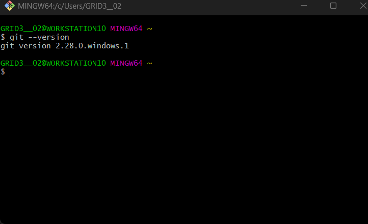
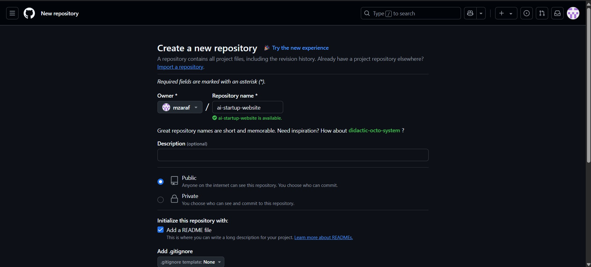
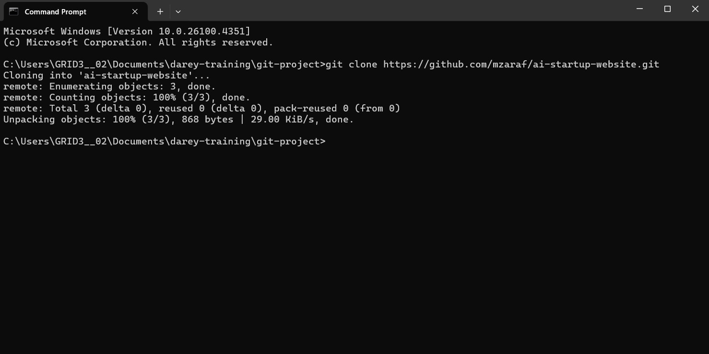
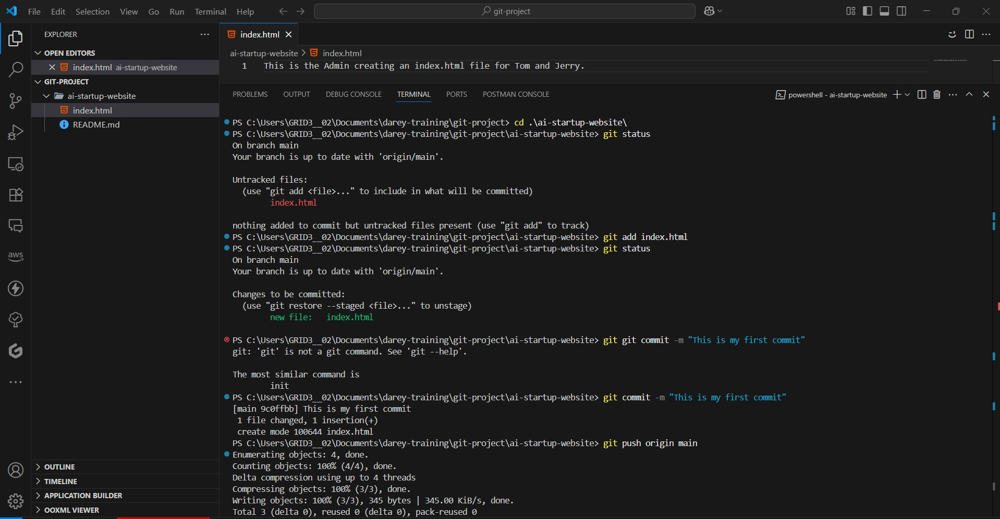
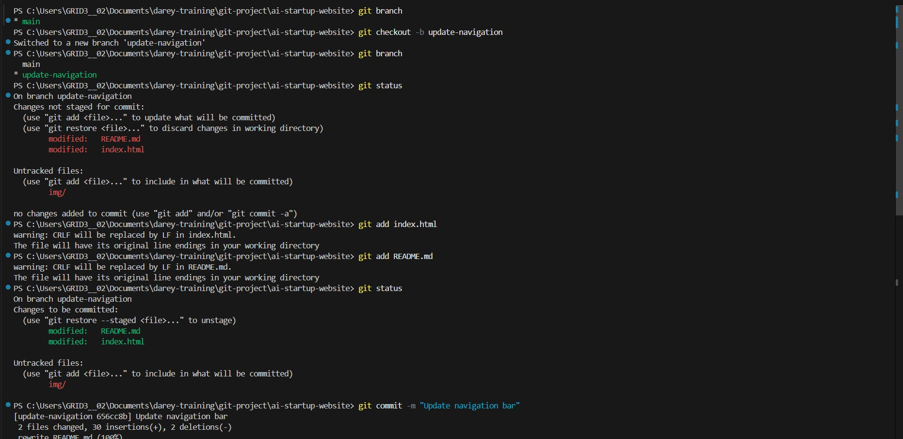
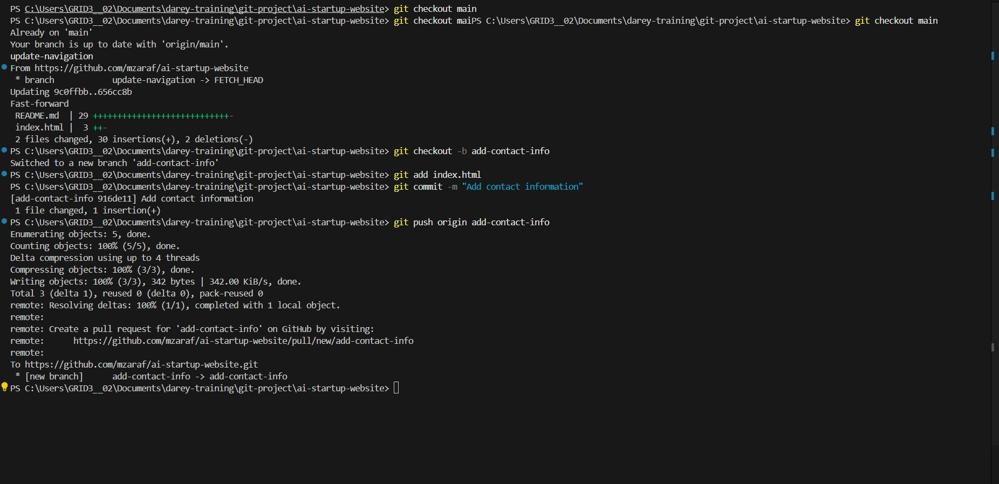
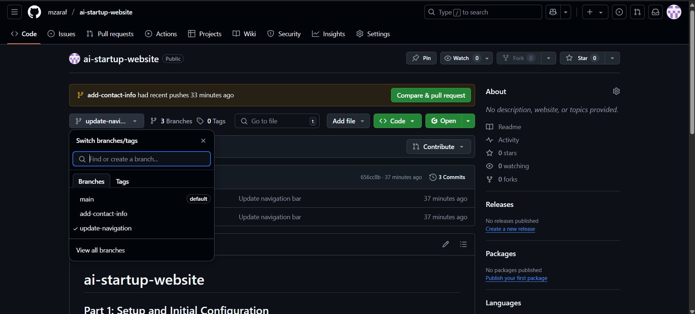
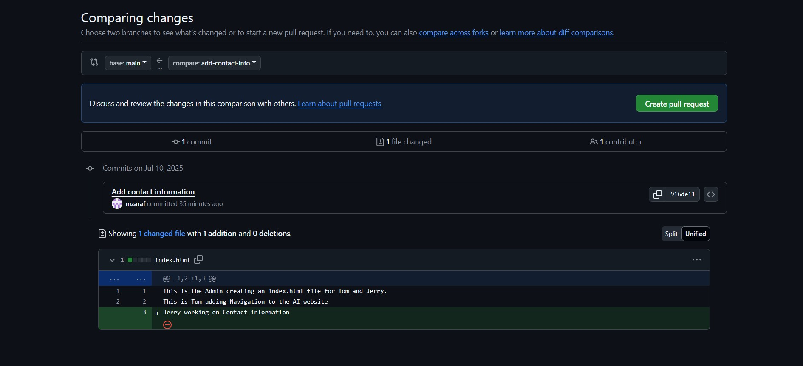
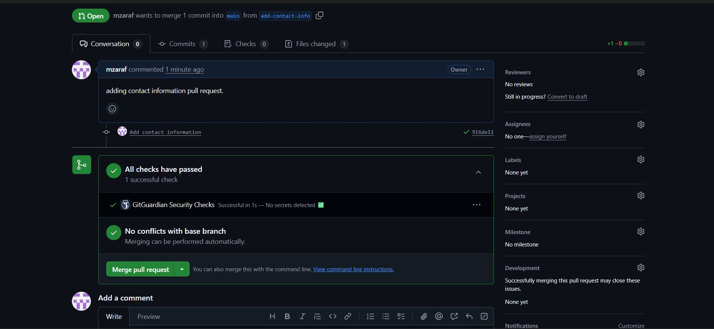

# ai-startup-website
## Part 1: Setup and Initial Configuration
### 1.1. install git
Git was downloaded from https://git-scm.com/downloads and installed. screenshot below:

### 1.2. Create a New Repository
Signed in to github and created a new repository called ai-startup-website. screenshot below:

### 1.3. Clone Repository
Cloned the repository to my local machine using the command git clone https://github.com/mzaraf/ai-startup-website.git screenshot below:

### 1.
Created index.html file in the root directory of the repository. added the following code to the file: "This is the Admin creating an index.html file for Tom and Jerry."

Then performed the following commands in the terminal:  
git status  
git add index.html  
git status  
git commit -m "This is my first commit"  
git push origin main

screenshot below:

## Part 2: Simulating Tom and Jerry's Work
### 2.1. Tom's Work
Created a new branch called update-navigation  

Switched to the new branch using the command `git checkout update-navigation  `

Edited the file Index.html in the root directory of the repository. added the following code to the file: "This is Tom adding Navigation to the AI-website". 

Run the following commands in the terminal:  
git status  
git add index.html  
git status  
git commit -m "Update navigation bar"  
git push origin update-navigation  
screenshot below: 

### 2.2. Jerry's Work
switch back to the main branch using the command `git checkout main  `  
Pull the latest changes from the remote repository using the command `git pull origin update-navigation  `

created a new branch called add-contact-info and switched to the new branch using the command `git checkout add-contact-info`  

Edited the file Index.html in the root directory of the repository. added the following code to the file: "This is Jerry adding Contact Information".  

Run the following commands in the terminal:  
git status  
git add index.html  
git status  
git commit -m "Add contact information"  
git push origin add-contact-info  
screenshot below:

## Part 3: Merging Changes
### 3.1. Create a Pull Request
Open github.com and navigate to the repository. click on the pull requests tab. click on the new pull request button. 

click on create pull request and select the base branch as main and the compare branch as update-navigation.
  

### 3.2. Merge the Pull Request
click on the merge pull request button. click on confirm merge.
screenshot below:

